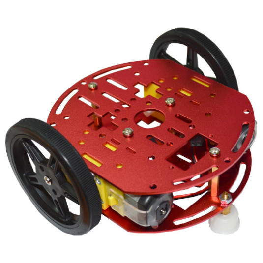
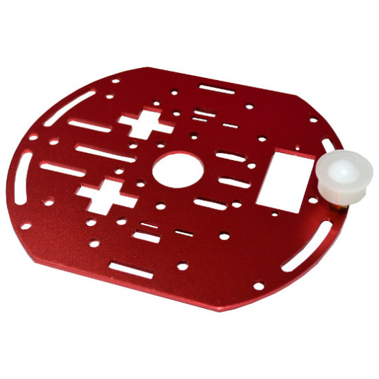
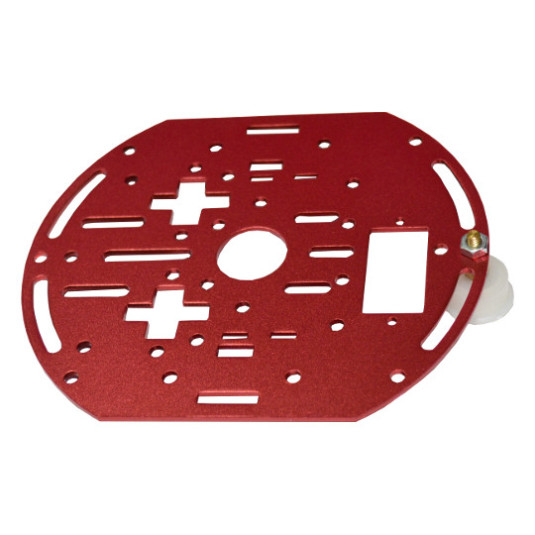
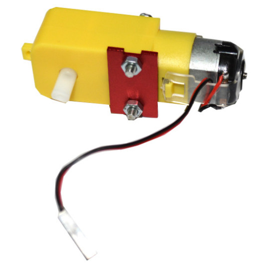
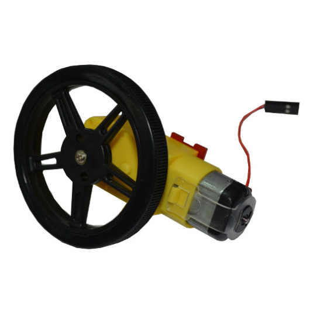
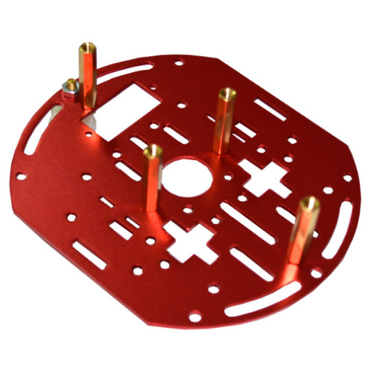

We have new Robot Chassis in stock!
It’s with two gear motors, two aluminum plates, a free-rolling castor wheel, two 60 mm wheels attached to the motors, andall necessary fittings.

Assembly is very simple:

The castor wheel is attached to bottom plate:

To the gear motor is attached small aluminum plate:

then the 60 mm wheel:

Four heximal spacers are assembled to the plate with the castor wheel:

Then the two gear motors aluminum plates are fixed between upper and bottom plate:

and the chassis is ready!

Now we are thinking for possible custom control board with these features:

- Arduino like main board allowing easy re-programming
- Motor drivers
- Motor encoders which to give feed back to Arduino with photo interrupters
- LiPo Battery charger and step up converter for motor and Arduino powering
- UEXT for ESP8266 WiFi
- two sockets for Ultrasonic distance sensors on the two sides of the castor wheel
- (optional RT5350F-OLinuXino with camera)
- connectors for optional servo motors for robot hand
- UEXT second connector for attaching more sensors

Let us know if we missed something :)

